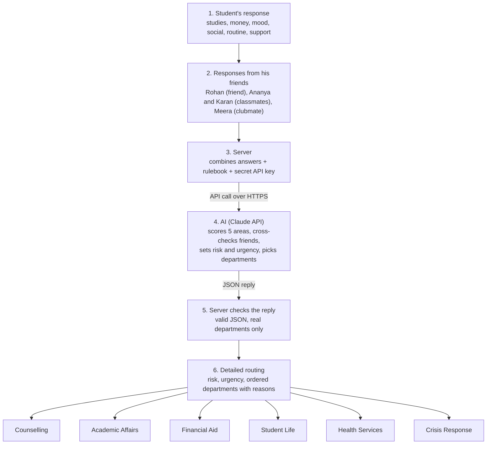

# Student Support Triage: How It Works

## Flow

```
┌─────────────────────────────────┐
│ 1. STUDENT'S RESPONSE           │
│                                 │
│  Rahul fills his own form:      │
│  • studies     • money          │
│  • mood        • social life    │
│  • daily routine • support      │
└────────────────┬────────────────┘
                 ▼
┌─────────────────────────────────┐
│ 2. RESPONSES FROM HIS FRIENDS   │
│                                 │
│  Rohan    →  friend's response  │
│  Ananya   →  classmate response │
│  Karan    →  classmate response │
│  Meera    →  clubmate response  │
│                                 │
│  each one answers:              │
│  • how has Rahul been?          │
│  • what has changed recently?   │
│  • anything else noticed?       │
└────────────────┬────────────────┘
                 ▼
┌─────────────────────────────────┐
│ 3. SERVER                       │
│                                 │
│  • combines Rahul's answers     │
│    + all 4 friends' responses   │
│  • adds the AI rulebook         │
│  • adds the secret API key      │
└────────────────┬────────────────┘
                 │  API call (HTTPS)
                 ▼
┌─────────────────────────────────┐
│ 4. AI  (Claude API)             │
│                                 │
│  • scores 5 areas out of 10     │
│  • checks if the friends back   │
│    up what Rahul said           │
│  • decides risk level + urgency │
│  • picks the departments        │
└────────────────┬────────────────┘
                 │  JSON reply
                 ▼
┌─────────────────────────────────┐
│ 5. SERVER CHECKS THE REPLY      │
│                                 │
│  • is it valid?                 │
│  • only real departments?       │
└────────────────┬────────────────┘
                 ▼
┌──────────────────────────────────────────────────────────┐
│ 6. DETAILED ROUTING                                      │
│                                                          │
│  Risk: HIGH     Urgency: URGENT     Confidence: HIGH     │
│                                                          │
│  ① COUNSELLING       stress very high, mood low, sleep   │
│                      worse, wants wellbeing support      │
│  ② ACADEMIC AFFAIRS  workload very difficult, missed     │
│                      deadlines (Karan confirms)          │
│  ③ FINANCIAL AID     money worries affecting studies     │
│                                                          │
│  + key signals, friend corroboration, suggested next step│
└──────────────────────────────────────────────────────────┘

        The AI recommends. People review and decide.
```

## In short

Rahul answers about himself, and his friends answer about him. The server sends both to the AI. The AI weighs them together, and the case goes to the right teams in priority order, with a reason for each.

## Mermaid version

Renders as a diagram on GitHub and in VS Code's Markdown preview.



## Where each part lives

| Step | File |
|---|---|
| 1-2. Form (student + friends) | `public/index.html` |
| 3, 5. Server | `server.js` |
| 4. AI rulebook | `prompt.txt` |
| Student details, fallback friend answers | `demo_data.json` |
| API key | `.env` |
